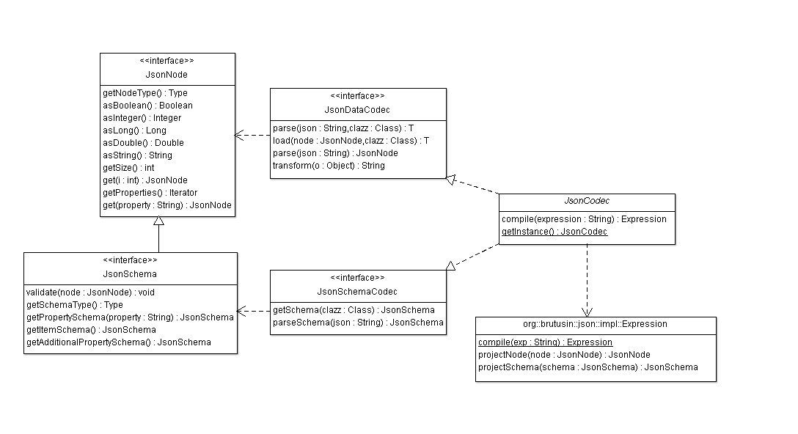

```
Under development
```

#org.brutusin:json [](https://travis-ci.org/brutusin/json) [](https://maven-badges.herokuapp.com/maven-central/org.brutusin/json/)

`org.brutusin:json` is a service provider interface ([SPI](http://en.wikipedia.org/wiki/Service_provider_interface)) that aggregates all the JSON-related functionality needed by the rest of Brutusin modules.

This module defines the general contract required to any implementing JSON service provider, allowing to use different pluggable implementations and decoupling client modules from them. 

**Table of Contents:** 

- [org.brutusin:json](#)
  - [Maven dependency](#maven-dependency)
  - [SPI](#spi)
    - [Data](#data)
    - [JSON Schema](#json-schema)
      - [Data validation](#data-validation)
    - [Path expressions](#path-expressions)
      - [Projections] (#projections)
  - [Java Annotations](#java-annotations)
  - [Service providers](#service-providers)
    - [JUnit tests for implementing providers](#junit-tests-for-implementing-providers)
    - [Reference implementation](#reference-implementation)
  - [Examples](#examples)
  - [ToDos](#todos)
  - [See also](#see-also)
  - [Support, bugs and requests](#support-bugs-and-requests)
  - [Authors](#authors)
  - [License](#license)
  
##Maven dependency 
```xml
<dependency>
    <groupId>org.brutusin</groupId>
    <artifactId>json</artifactId>
    <version>${json.version}</version>
</dependency>
```

Click [here](http://search.maven.org/#search%7Cga%7C1%7Cg%3A%22org.brutusin%22%20a%3A%22json%22) to see the latest available version released to the Maven Central Repository.

If you are not using maven and need help you can ask [here](https://github.com/brutusin/json/issues).

##SPI
[JsonCodec](src/main/java/org/brutusin/json/spi/JsonCodec.java) is the single entry point to the framework. It defines a SPI (service provider interface) that is implemented by pluggable service providers. Clients of the service make use of it by calling:
```java
JsonCodec.getInstance()
```
`JsonCodec` provides three types of operations: Data operations (inherited from [JsonDataCodec](src/main/java/org/brutusin/json/spi/JsonDataCodec.java)), schema operations (inherited from [JsonSchemaCodec](src/main/java/org/brutusin/json/spi/JsonSchemaCodec.java)) and path expression operations (via `compile(String expression)`)


###Data
Data methods declared in `JsonDataCodec` offer **Object/JSON binding** (get JSON representations from objects and object tree instantiation from JSON data) and a generic API to interact with JSON data in a generic way ([JsonNode](src/main/java/org/brutusin/json/spi/JsonNode.java)).
###JSON Schema
A JSON schema ([specifications](http://json-schema.org/)) is a JSON document that describes the structure of other JSON documents. 

Schemas are represented by the interface [JsonSchema](src/main/java/org/brutusin/json/spi/JsonSchema.java), and instantiated by the methods in `JsonSchemaCodec`, either by parsing the JSON Schema document (`parseSchema(String json)`) and by reflection from a `Class` instance (`getSchema(Class<T> clazz)`).
####Validation
Schemas are useful both for describing the structure and for validating `JsonSchema.validate(JsonNode node)` that JSON data complies the constraints imposed by them.

###Path expressions
Path expressions allow referencing JSON data and schema subparts and traversing the JSON node tree. 

Despite of the existence of `JsonPointer` ([?] https://tools.ietf.org/html/rfc6901) as a standard alternative, this specification is still very inmature and provides only basic traversal expressions.

Instead this module defines its own expression semantics, supporting both data, and schema projections (wildcard expressions evaluating to multiple nodes), and also keeping explicit information of the schema structure.

Case | Expression
-----| -----------------
Root node| `$`
Simple property| `$.id`
Nested property| `$.header.id`
Array/Collection property| `$.items[#]`
Map property (additionalProperty in schema)| `$.map` for keys and `$.map[*]` for values


## Java Annotations
The following annotations can be used to customize schema generation, and must be supported by all providers:
* [`@JsonProperty`](src/main/java/org/brutusin/json/annotations/JsonProperty.java). Lets specify standard schema properties like, default value, enumeration, title, description,...
* [`@IndexableProperty`](src/main/java/org/brutusin/json/annotations/IndexableProperty.java). Adds custom `"index":"index"` or `"index":"facet"` properties to the schema generated.

## Service Providers
Service providers are modules implementing this SPI and registering themselves via the [ServiceLoader](http://docs.oracle.com/javase/6/docs/api/java/util/ServiceLoader.html) standard facility. 
### JUnit tests for implementing providers
All service providers must pass the JUnit tests included in this module. In order to that, the following maven dependence has to be included
```xml
<dependency>
     <groupId>org.brutusin</groupId>
     <artifactId>json</artifactId>
     <type>test-jar</type>
     <version>${json.version}</version>
     <scope>test</scope>
</dependency>
```
and 
[predefined tests](https://github.com/brutusin/json/tree/master/src/test/java/org/brutusin/json/spi) have to be extended by the service provider tests.

### Reference implementation
See [org.brutusin:json-provider](https://github.com/brutusin/json-provider) for a reference implementation.

## Examples

##ToDos
* Standard annotations also for data binding (not only for schema customization), supporting property ordering, ignoring properties...
* Since annotation inheritance is not allowed in java, introduce some mechanism for schema extension (allowing non-standard schema properties) to be used by the service providers. This also would help to move `@IndexableProperty` (aimed at being used by `org.brutuisn:flea-db`) out of this module.

##See also
* [ServiceLoader](http://docs.oracle.com/javase/6/docs/api/java/util/ServiceLoader.html) for more details.
* [org.brutusin:json-provider](https://github.com/brutusin/json-provider), the default JSON service provider.

## Support bugs and requests
https://github.com/brutusin/json/issues

## Authors

- Ignacio del Valle Alles (<https://github.com/idelvall/>)

Contributions are always welcome and greatly appreciated!

##License
Apache License, Version 2.0
